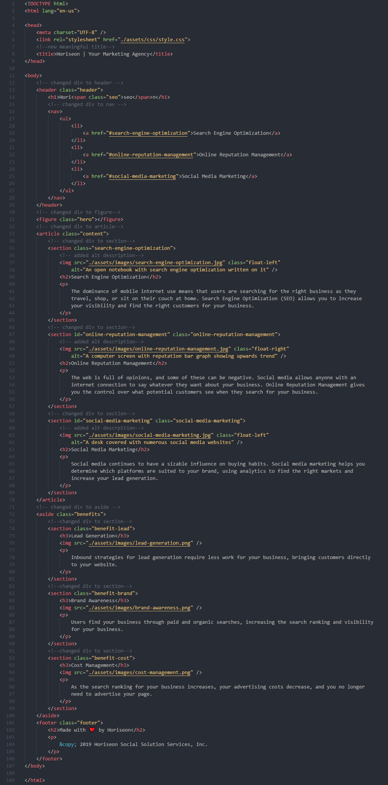
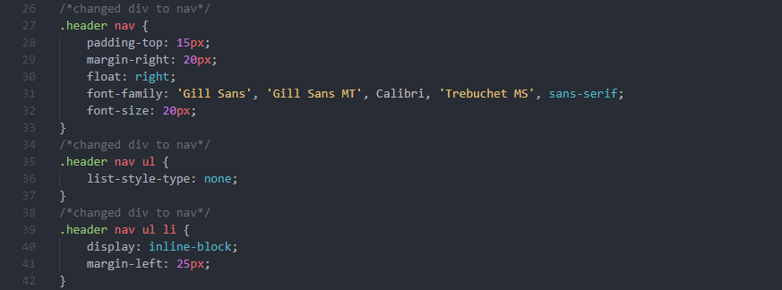

# 01: Code Refractor

The purpose of this project is to understand the value of web accessibility and the usage of semantic HTML. Web accessibility ensures that people with disabilities can access websites using assistive technologies like video captions, screen readers, and braille keyboards. Using more specific tags in your HTML makes it easier for you and others understand your code.

## Task Given

### User Story

```
AS A marketing agency
I WANT a codebase that follows accessibility standards
SO THAT our own site is optimized for search engines
```
<details>
    <summary markdown="span" style="font-weight: bolder">Click to show screenshot of the website! 
    </summary>
    
</details>
<br>

### Acceptance Criteria

```
GIVEN a webpage meets accessibility standards
WHEN I view the source code
THEN I find semantic HTML elements
WHEN I view the structure of the HTML elements
THEN I find that the elements follow a logical structure independent of styling and positioning
WHEN I view the icon and image elements
THEN I find accessible alt attributes
WHEN I view the heading attributes
THEN they fall in sequential order
WHEN I view the title element
THEN I find a concise, descriptive title
```

## Solution

To fit the criteria in <code>index.html</code>,

in line 8:

    <title>Horiseon | Your Marketing Agency</title>

the title was changed to something more meaningful for the user.

in line 13:

    <header class="header">

<code>div</code> was changed to <code>header</code>.

in line 16:

    <nav>

<code>div</code> was changed to <code>nav</code> to better label the section of the navigation bar.

in line 31:

    <figure class="hero"></figure>

<code>div</code> was changed to <code>figure</code> to better label the image.

in line 33:

    <article class="content">

<code>div</code> was changed to <code>article</code>.

in line 35:

     <section class="search-engine-optimization">

<code>div</code> was changed to <code>section</code>.

in line 37:

    

the image was given a description in the case it does not load.

in line 72:

    <aside class="benefits">

<code>div</code> was changed to <code>aside</code>.


<details>
    <summary markdown="span">Click to show screenshot of HTML code. Changes have been commented.</summary>
    
</details>

<br>
Because of the tag name changes, some changes had to be made in <code>style.css</code>.

In line 27, 35, and 39: all the <code>div</code> tags were changed to <code>nav</code>.
<details>
    <summary markdown="span">Click to show screenshot of CSS code. Changes have been commented.</summary>
    
</details>

<br>

## Built With

* [HTML](https://developer.mozilla.org/en-US/docs/Web/HTML)
* [CSS](https://developer.mozilla.org/en-US/docs/Web/CSS)

## Deployed Link

* [See Live Site](https://icortes.github.io/code-refractor-hw/)


## Authors

* **Isaac Cortes Hernandez** 

- [Link to Portfolio Site](https://icortes.github.io/)
- [Link to Github](https://github.com/icortes)
- [Link to LinkedIn](https://www.linkedin.com/in/cortes-isaac)

## License

This project is licensed under the MIT License 

## Acknowledgments

* [w3schools](https://www.w3schools.com/)
